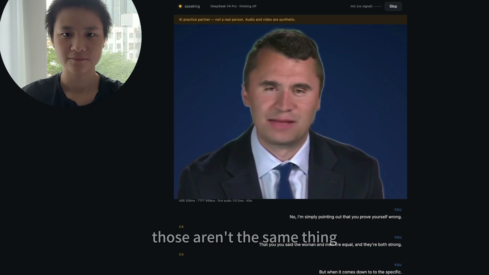
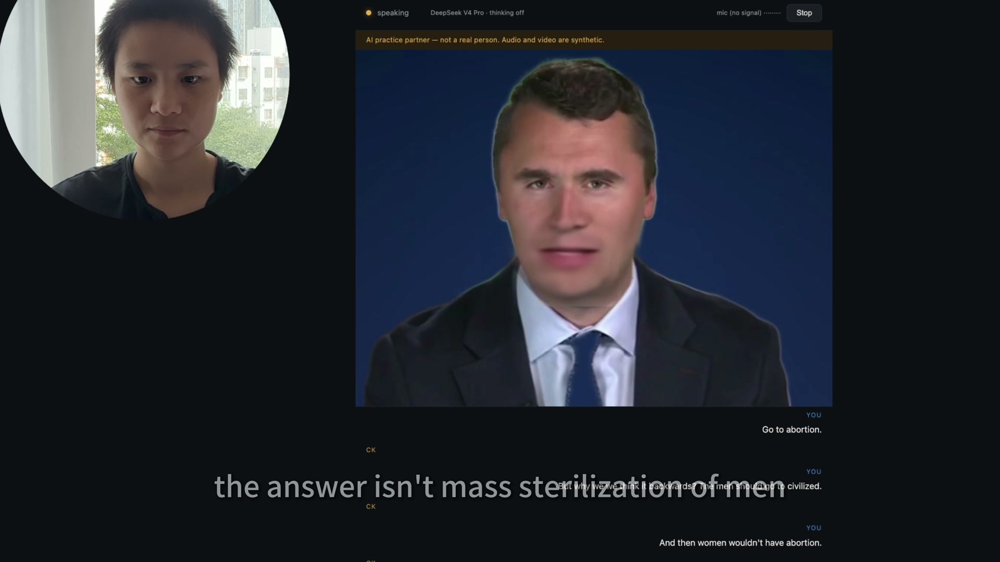
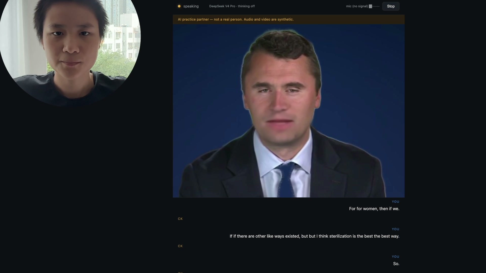
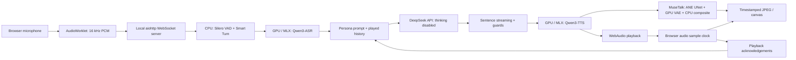

# distillCKirk — an AI debate avatar on a MacBook Pro

An English-speaking debate partner inspired by Charlie Kirk's public statements, with streaming speech, audio-driven lip sync, and interruption handling. Built and demonstrated on an **Apple M5 Max MacBook Pro with 128 GB unified memory**.

**The finished demo uses a hybrid architecture:** speech recognition, speech synthesis, and avatar processing run on the Mac; **DeepSeek V4 Pro generates replies through its API, with thinking disabled**. A local Qwen brain remains an explicit alternative.

**Primary inspiration and credit: [emwstudio/VoxEMW](https://github.com/emwstudio/VoxEMW).** Its voice-avatar architecture, Mac experiments, and engineering notes were the starting reference. This implementation replaces the rendering path with MuseTalk on MLX/Core ML and adds its own browser playback, session, and interruption handling. [Full attribution](docs/ATTRIBUTION.md).

[中文说明](README.zh-CN.md) · [Architecture](docs/ARCHITECTURE.md) · [Setup and asset preparation](docs/REPRODUCIBILITY.md)

## Watch the finished result

- **English demo on YouTube:** [Debating the AI avatar](https://www.youtube.com/watch?v=DtIkQjkBrZg)
- **Demo on Bilibili:** [项目演示视频](https://www.bilibili.com/video/BV14oHv6qEDb)



*Frame at 03:45 from the finished video. The avatar, live transcript, actual brain selection, and permanent synthetic-media label are visible. This is a frame from the recorded demonstration, not a generated mockup.*

<details>
<summary>More frames from the finished video</summary>





Screenshot timestamps and demo links are recorded in [frames.json](docs/demo/frames.json). The full video and original reference clips are not stored in Git.

</details>

## What the project does

- Listen through a browser microphone and detect the end of a spoken turn.
- Transcribe English locally, then send the text and conversation context to the selected LLM.
- Generate new replies using a researched persona prompt: 26 sourced position entries, reasoning-pattern annotations, and 15 rhetorical tactics.
- Stream reference-audio-conditioned speech and render the mouth from that same audio.
- Allow the user to interrupt while a reply is playing; stop obsolete audio and video together.
- Commit only fully played speech segments to conversation history.
- Preserve completed microphone input through reply interruptions, and archive audio and full transcripts locally.
- Restore a saved conversation through a validated one-use seed.
- Keep a closed-mouth frame during silence; mouth animation follows actual reply playback.

“Distillation” here means **persona research and prompting**. There is no Charlie-specific LLM fine-tuning, and no claim that generated replies are his authentic statements. The interface identifies the speaker as an AI practice partner throughout.

## Architecture at a glance



| Layer | Implementation in the finished demo | Execution |
|---|---|---|
| Microphone, playback, subtitles | AudioWorklet, WebSocket, WebAudio, canvas | Browser on the Mac |
| Speech activity / turn completion | Silero VAD v5, Smart Turn v3 | Local CPU / ONNX Runtime |
| Speech recognition | `Qwen/Qwen3-ASR-1.7B`, `mlx-qwen3-asr` | Local Metal GPU / MLX |
| Conversation | `deepseek-v4-pro`, OpenAI-compatible streaming API | Remote API; thinking off |
| Alternative conversation backend | `Qwen3-30B-A3B-Instruct-2507` 4-bit, MLX-LM | Local GPU, explicitly selected |
| Speech synthesis | Qwen3-TTS Base, MLX 8-bit conversion | Local GPU; reference-audio conditioning |
| Lip-sync UNet | MuseTalk weights converted with Apple's ANE-oriented UNet | Local Core ML, CPU + Neural Engine |
| Audio features / VAE decode | MuseTalk MLX pipeline | Local GPU |
| Face placement / compositing | NumPy / OpenCV, FeatherTalk detector helper | Local CPU |
| Optional semantic checks | TypeSafe SDK; no key means disabled | Remote service when configured |

The avatar output is **640 × 480 with a configured target of 20 fps**. The 4K demonstration video is a recording/editing output, not the resolution generated by MuseTalk. The implementation uses an **aiohttp** server, not FastAPI. See [the detailed architecture](docs/ARCHITECTURE.md) for timing, hardware scheduling, wire protocol, and failure behavior.

## Reproduce the project

This is a source release of a working development setup. **A fresh clone requires model downloads, a Core ML conversion, and your own reference media before the complete avatar can run.** Model weights, voice inputs, face clips, private logs, and API keys are deliberately not bundled.

```bash
git clone --recurse-submodules https://github.com/liwagu/distillCKirk.git
cd distillCKirk
uv venv --python 3.12 .venv
uv pip install --python .venv/bin/python -r requirements.txt
cp .env.example .env.local
```

Then follow [REPRODUCIBILITY.md](docs/REPRODUCIBILITY.md) to prepare the models, voice reference, face clip, Core ML package, and face configuration. Put your own DeepSeek key only in `.env.local`.

After preparing those assets:

```bash
.venv/bin/python scripts/service.py start
.venv/bin/python scripts/service.py status
.venv/bin/python scripts/service.py stop
```

Open `http://127.0.0.1:8000`, click **Start**, permit microphone access, and speak. Start/Stop creates a new session. `--local-llm` explicitly selects the local Qwen alternative; API failures do not silently switch brains. The managed service runs Hugging Face loading offline, so finish the downloads first.

## Conversation archives and restoration

Completed speech is saved before transcription to `conversations/session-*/audio/*.wav`. The same session's `events.jsonl` records full user transcripts and the reply segments actually played. A separate FIFO worker transcribes accepted input even when a new utterance interrupts the reply. Consecutive user fragments are combined in the model request; the complete local history is retained while the model uses a bounded recent window.

To resume a selected conversation, prepare `conversations/resume-next.json` before clicking Start:

```json
{"messages":[{"role":"user","content":"My earlier question."},{"role":"assistant","content":"The reply I heard."}]}
```

Only `user` and `assistant` messages are accepted. The next connection loads and displays the validated history, then archives the seed as `resume-consumed-*.json`. Invalid seeds are preserved. Restoration waits for new input before generating a reply. Stop drains accepted transcription work before closing its archive. Sessions use private directories/files, and the entire `conversations/` directory is ignored by Git.

These are durable local archives and explicit restoration, not automatic long-term memory across every Stop/Start. Earlier turns outside the model's recent context window are not automatically recalled. See [the input and history fix](docs/ASR-INPUT-FIX-2026-10-05.md).

## Verification and practical limits

The published demo shows a real recorded conversation. Engineering checks separately cover playback acknowledgements, interruption, session lifecycle, idle-face behavior, sentence streaming, repeat handling, and the no-thinking request format.

```bash
.venv/bin/python -m unittest discover -s tests -v
node --check web/app.js
node tests/test_face_playback.cjs
```

With a running service and Playwright, the optional browser smoke scripts exercise the full chain with **synthetic microphone input**. They are useful regressions, but are not a substitute for listening to the actual microphone/speaker setup. [Release checks](docs/RELEASE-CHECKS.md) distinguish current source checks from earlier runtime measurements.

This remains a prototype: source clips affect pose and visual quality; reply gaps and frame delays can occur; ASR can mishear; prompted personas and semantic checks can still produce unsupported claims. Idle mode currently uses a static neutral frame. TypeSafe's optional timeout behavior is fail-open, so a completed reply does not mean it passed semantic review. Earlier benchmark reports are hardware-specific records, not performance guarantees for a fresh machine.

## Repository map

```text
run.py                    configuration, environment loading, server startup
configs/assistant.json    local runtime and face settings
voxck/                    ASR, VAD, LLM, TTS, guards, renderer, orchestration
web/                      microphone, playback, captions, canvas UI
personas/                 researched persona prompt and template
corpus/raw/               historical research dossiers with source links
scripts/                  service manager, model/export tools, smoke tests, benchmarks
tests/                    playback and conversation regression tests
docs/                     current design, setup, attribution, historical measurements
docs/demo/                selected frames from the finished demonstration
ref-*/                    pinned upstream Git submodules
video-script/             selected English expression / presentation materials
```

Historical research and design proposals are retained for transparency and may describe superseded choices. Current runtime facts are in this README and [ARCHITECTURE.md](docs/ARCHITECTURE.md).

## Credits and reuse

Start with **[VoxEMW](https://github.com/emwstudio/VoxEMW)**. We also acknowledge Qwen, MuseTalk and its MLX port, FeatherTalk, Apple MLX/Core ML tooling, Silero, Pipecat Smart Turn, and [nuwa-skill](https://github.com/alchaincyf/nuwa-skill) as a persona-methodology reference.

The four upstream repositories are pinned submodules; their code retains its own license and notices. Model weights and media have separate terms. [ATTRIBUTION.md](docs/ATTRIBUTION.md) documents these boundaries, including unresolved detector-weight provenance. This repository does not assign a blanket license to all code, models, research quotations, or media.
