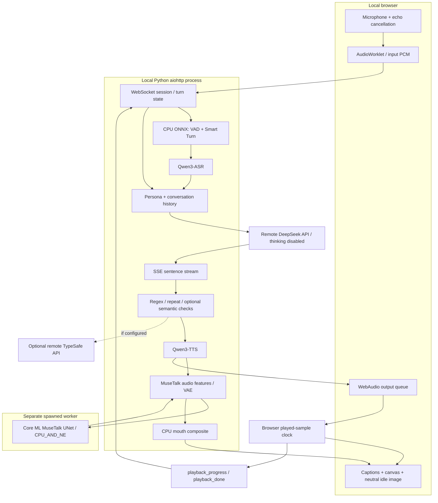

# Architecture of the finished debate-avatar demo

This document describes the implemented pipeline published in October 2026. Earlier feasibility reports remain in this directory as historical evidence; their proposed model choices and estimated performance are not the current architecture.

The demonstrated machine is an Apple M5 Max MacBook Pro with 128 GB unified memory. The system is **hybrid**: local speech and avatar inference plus a remote DeepSeek conversation API. No Charlie-specific neural-network training is performed.

## 1. Design goal and lineage

The goal was to hold a spoken English debate with a recognizable, explicitly synthetic persona, including follow-up questions and interruptions. It had to work on Apple Silicon while ASR, speech synthesis, and lip sync shared local compute resources.

The primary architectural reference was [emwstudio/VoxEMW](https://github.com/emwstudio/VoxEMW), especially its streaming voice pipeline and audio/video scheduling lessons. The current implementation does not launch VoxEMW's CUDA/SoulX servers. It uses Qwen speech models, a researched persona, MuseTalk's MLX port, a Core ML UNet conversion, and a browser client. See [ATTRIBUTION.md](ATTRIBUTION.md) for authors, pinned upstream revisions, and code/model/media distinctions.

## 2. Processes, components, and boundaries



| Boundary | Purpose |
|---|---|
| Browser ↔ local server | Control JSON, microphone PCM, reply PCM, timestamped JPEG frames, playback acknowledgements |
| Local server ↔ DeepSeek | Persona prompt, transcribed user turns, played conversation history; streamed answer text |
| Local server ↔ TypeSafe, if enabled | Sentence-level semantic checks; an optional external dependency |
| Python ↔ ANE worker | NumPy tensors over a multiprocessing Pipe; Core ML runs in a separate process |
| Python ↔ local MLX-LM, when explicitly selected | Alternative OpenAI-compatible localhost LLM server |

Raw microphone audio is recognized locally. In the default published API configuration, the text transcript and context leave the Mac for the selected brain; optional semantic checks also send sentence text to their service. API credentials stay on the server side and are not part of the browser protocol.

`run.py` loads `configs/assistant.json`, then applies `.env.local` overrides. The JSON preserves the original local Qwen setting. The provided `.env.example` selects the finished demo's remote DeepSeek configuration. With `--local-llm`, the local backend is deliberately selected instead. A remote error does not automatically switch to Qwen.

## 3. Input speech and turn completion

The browser obtains a MediaStream through a user gesture and turns microphone samples into **16 kHz mono PCM** using an AudioWorklet. It communicates through `/ws` on the local aiohttp service. Start also unlocks the output AudioContext so browsers can play the eventual reply.

`voxck/vad.py` uses Silero VAD v5 to recognize speech activity, then Smart Turn to estimate whether the user has finished the turn. Both run through CPU ONNX Runtime. The configured ONNX thread count is one; these small workloads do not need to compete with the GPU or Neural Engine.

Configured timing is a starting point, not a universal speaking style: VAD threshold 0.5, two start frames, 350 ms hangover, Smart Turn threshold 0.8, and a 900 ms silence ceiling. Short pauses, accents, background sound, and speaker echo can affect turn detection. Browser echo cancellation helps, and headphones make a first test easier to assess.

`voxck/asr.py` uses `mlx-qwen3-asr` with `Qwen/Qwen3-ASR-1.7B`. Its actual implementation is MLX, so earlier transformer-specific warnings about a `-hf` variant do not apply to this path. It accepts normalized 16 kHz waveform data and transcribes English. The configured hotword list contains only `feminism`; broad hotword lists can bias transcription toward words that were not spoken.

## 4. Persona and conversation brain

`voxck/persona.py` reads the persona frontmatter and Markdown body. The body becomes a system prompt; frontmatter supplies display and reference-audio settings.

The prompt in `personas/ck-gender.md` contains a ledger of **26 public-statement entries**, confidence labels, and “warrants”: analyst-written descriptions of a reasoning pattern. It also specifies **15 rhetorical tactics**, spoken-language behavior, and how to handle unclear ASR input or direct challenges. A warrant is an interpretation, not an original quotation. A source confidence label is not a fact-check of the underlying political claim.

This is a prompting approach. No LLM parameters were trained on Charlie Kirk's recordings. The generated replies are new model output constrained by the prompt, rather than recovered speech from the real person. The UI's permanent synthetic-media label communicates that boundary to the audience.

The finished demo uses `deepseek-v4-pro` through `https://api.deepseek.com`, with the request field:

```json
{"thinking": {"type": "disabled"}}
```

`voxck/llm.py` consumes only answer `content`, never `reasoning_content`. It reads SSE incrementally, splits complete sentences, and yields them to the speech pipeline. The configuration allows 300 completion tokens, temperature 0.7, a 90-word spoken ceiling, and a bounded conversation history. These values favor conversational turns over long lectures.

HTTP 200 and SSE heartbeats are not treated as a successful answer. A first-answer deadline applies until nonempty answer content arrives. Once speech generation consumes the stream, that first-content deadline is removed so TTS work is not counted as the brain failing to respond. Empty responses, connection errors, and timeouts produce explicit failures. Incomplete trailing sentences after a token-limit truncation are normally discarded.

The local Qwen option uses the OpenAI-compatible MLX-LM server and `chat_template_kwargs.enable_thinking=false`. The historical cache measurements in `prefill-measured.md` apply to that backend, not to the current DeepSeek service or to every possible MLX model.

## 5. Sentence streaming and guards

`voxck/orchestrator.py` combines answer sentences into practical speech segments rather than synthesizing every tiny fragment. The configured minimum is 12 words, subject to sentence and end-of-response handling. This reduces repeated synthesis startup and gives the renderer enough audio to work with.

The guard layers serve different purposes:

- `voxck/guard.py` handles known prohibited patterns, internal prompt labels, and repetition checks.
- Persona rules instruct the brain to respond to the latest turn instead of selecting a slogan from one topic keyword.
- `voxck/semantic_guard.py` optionally asks TypeSafe about personal attacks and invented specific statistics/authorities.

TypeSafe requires its own credential and is disabled when that key is absent. Current configuration is non-strict: the first sentence is audited, subsequent checks may wait within the existing budget, and service failures/timeouts are fail-open. This avoids making a transient guard outage halt all speech, but it also means an emitted answer is not proof of a successful audit. These checks do not establish full persona fidelity or truthfulness.

## 6. Local voice synthesis

`voxck/tts.py` loads `mlx-community/Qwen3-TTS-12Hz-1.7B-Base-8bit` through MLX Audio. The Base model is conditioned on a reference recording and its verbatim text; the public source release does not include the original reference voice.

The reference is loaded once at **24 kHz** and reused as an array. Passing the right sample rate matters because the speaker-embedding path assumes it. Reusing the same reference avoids rereading audio for each sentence and permits the model's conditioning cache to be reused.

Speech is generated in chunks, converted from its model dtype to float32, and resampled from 24 kHz to the pipeline's **16 kHz int16 PCM**. A short initial fade reduces reset clicks. Interruption advances an epoch immediately, so even a generator that has not begun executing cannot accidentally clear a newer cancellation. The speech decoder's streaming state is reset after an interrupted generation.

Missing voice assets are not a reliable substitute for the demonstrated voice: although the wrapper logs a default-voice message, reproducing this Base-model path requires preparing a valid reference pair. The setup guide therefore treats reference audio and text as required assets.

## 7. MuseTalk on CPU, GPU, and Neural Engine

The lip-sync path consumes the **same synthesized audio** that the browser plays. It modifies the mouth region on a reference clip; it is not a full diffusion video generator and does not infer a new body scene.

`voxck/face.py` uses the MLX MuseTalk port for audio features and VAE operations. `scripts/export_unet_ane.py` maps the MuseTalk weights into Apple's Neural Engine-oriented UNet structure and converts it to `assets/coreml/musetalk_unet_ane_b1.mlpackage`.

| Work | Resource | Why |
|---|---|---|
| VAD and Smart Turn | CPU ONNX | Small work, isolated from speech/render GPU demand |
| ASR and TTS | GPU / MLX | Native Apple Silicon inference ports |
| MuseTalk audio encoding and VAE | GPU / MLX | Efficient local tensor inference |
| MuseTalk UNet | Core ML `CPU_AND_NE` worker | Allows Neural Engine execution without putting this model on the Metal GPU |
| Face detection, masks, paste-back | CPU | Preprocessing and image compositing |
| Browser scheduling and drawing | Browser | Uses the actual playback clock |

`CPU_AND_NE` is the selected compute-unit configuration; it does not mean every operation is independently proven to execute on ANE. The separation was chosen after measured GPU-only rendering degraded under competing workloads. Historical hardware and contention studies are in `measured-hardware.md`, `musetalk-measured.md`, and `ane-verified.md`.

All MLX calls are dispatched to one execution thread because MLX streams are thread-local. The ANE worker uses multiprocessing **spawn**, avoiding a fork of the initialized Metal/Objective-C runtime. Rendering and synthesis still share resources; moving UNet to Core ML reduces contention rather than eliminating every source of delay.

Reference preprocessing reads the clip, resamples its base frames to 25 fps, applies optional pre-cropping/background replacement, detects the face, and precomputes VAE latents. Face detection uses FeatherTalk's SCRFD helper. The cached latents depend on the clip and crop/background settings and are regenerated when that cache key changes.

During speech, the renderer decodes the useful lower-face region, feathers the generated mouth into the base frame, and produces JPEG output at **640 × 480**, with **20 fps configured**. A tight face crop matters: a wide crop leaves too few pixels for the mouth model. The configured crop is specific to the development clip; it must be changed for another source video.

Background replacement is optional and requires additional model assets. A first reproduction can disable it. Model weights, converted packages, caches, and source clips are absent from the public repository; [REPRODUCIBILITY.md](REPRODUCIBILITY.md) explains preparation and [ATTRIBUTION.md](ATTRIBUTION.md) records the model-license boundaries.

## 8. Playback clock, protocol, and interruptions

The WebSocket uses JSON for control and binary messages for media:

| Packet | Payload |
|---|---|
| `A` byte prefix | Mono 16 kHz little-endian int16 PCM reply audio |
| `V` byte prefix | Little-endian uint16 turn ID, uint32 presentation timestamp in ms, then JPEG bytes |
| JSON `turn` / `caption` | Turn metadata and timed text |
| JSON `generation_done` | Backend has finished producing this reply; audio may still be queued |
| JSON `playback_progress` / `playback_done` | Client-reported progress through actually played samples |
| JSON `interrupt` | Invalidate the old turn's audio, video, and generation state |

Because the one-byte audio prefix leaves PCM at an odd byte offset, the frontend reads samples with DataView instead of constructing an aligned Int16Array over that offset. This fixed a real playback failure.

The browser schedules AudioBufferSources and tracks an audio sample clock. Captions and frames have presentation timestamps relative to the turn. The canvas chooses frames using that clock; independent sleeps are not allowed to accumulate audio/video drift. Generation speed and network receipt time are not substituted for what the listener has heard.

`PlaybackTurn` records produced segments and their audio ranges. Client acknowledgements commit only the **complete synthesis segments whose audio has finished playing**. Partial segments are not reconstructed word by word. This avoids an interrupted model subsequently acting as though the listener heard an unsaid paragraph.

When the user speaks during reply playback:

1. VAD triggers interruption, advancing the active generation epoch and turn state.
2. The browser stops scheduled old audio, clears captions/frame queues, and restores the idle image.
3. Backend synthesis/rendering for the old turn becomes obsolete; late frame decodes and acknowledgements cannot complete the new turn.
4. The next user turn is recognized and sent with the played history that remains.

The backend distinguishes **generation completed** from **playback completed**. A reply may finish generating while many seconds are still audible. The session remains speaking until playback completion or interruption. Stop and connection teardown use the same cancellation discipline. A fresh Start opens a new backend conversation; old transcript bubbles on screen do not carry its context into the new session.

## 9. Why the mouth stays closed during silence

Early versions looped reference footage, which could show speaking motion even when no reply audio existed. The current implementation displays a manually checked closed-mouth base frame in idle mode. Speech-driven frames are eligible only while the active reply is actually playing.

Natural playback completion, an audio gap, an interruption, Stop, and stale-turn rejection restore that neutral image. The current idle mode is intentionally static; it has no generated blinking animation. See `IDLE-MOUTH-FIX-2026-10-02.md` and the playback/idle regression tests for the evidence and implementation history.

## 10. Service, readiness, and diagnostics

`scripts/service.py` owns only the process it starts. Its state includes PID identity and executable/start-time checks; it avoids indiscriminate process-name kills. Start, status, stop, and restart operate on that owned local service.

The managed launch enables Hugging Face offline loading, so downloads and conversion must be complete beforehand. `/health` reports the selected brain, thinking configuration, and local readiness. Neutral idle images arrive through the WebSocket media protocol. Brain warm-up expects answer text, rather than merely a reachable model list. Logs and generated reports remain in ignored `logs/` and may contain user transcripts.

Browser smoke tests inject explicitly synthetic English microphone audio through the original AudioWorklet/WebSocket path. Unit tests isolate request format, guard behavior, playback acknowledgements, stale events, idle behavior, and session state. A successful regression suite does not certify voice similarity, echo cancellation, avatar fidelity, or every model-generated claim.

The finished linked video is evidence that the demonstrated system was used for a recorded conversation. It is not a cross-machine performance benchmark. Current source verification and its limits are in [RELEASE-CHECKS.md](RELEASE-CHECKS.md).

## 11. Code entry points

| File | Responsibility |
|---|---|
| [`run.py`](../run.py) | Environment/configuration, backend selection, aiohttp startup |
| [`voxck/orchestrator.py`](../voxck/orchestrator.py) | Sessions, turn lifecycle, worker scheduling, history, packet emission |
| [`voxck/vad.py`](../voxck/vad.py), [`voxck/asr.py`](../voxck/asr.py) | Turn detection and transcription |
| [`voxck/persona.py`](../voxck/persona.py), [`personas/ck-gender.md`](../personas/ck-gender.md) | Persona parsing and sourced prompt |
| [`voxck/llm.py`](../voxck/llm.py) | Streaming answer client and no-thinking request |
| [`voxck/guard.py`](../voxck/guard.py), [`voxck/semantic_guard.py`](../voxck/semantic_guard.py) | Pattern/repeat checks and optional external semantic checks |
| [`voxck/tts.py`](../voxck/tts.py), [`voxck/segment.py`](../voxck/segment.py) | Speech generation and segmentation |
| [`voxck/face.py`](../voxck/face.py), [`voxck/ane_worker.py`](../voxck/ane_worker.py) | MLX/Core ML renderer and worker process |
| [`web/app.js`](../web/app.js) | Microphone transport, audio scheduling, canvas, captions, ACKs |
| [`scripts/export_unet_ane.py`](../scripts/export_unet_ane.py) | Build-time ANE-oriented Core ML conversion |
| [`scripts/service.py`](../scripts/service.py) | Owned process management |

## 12. Public-release scope

The release includes application source, tests, configuration, persona research, benchmark/conversion scripts, selected presentation materials, and three frames from the finished demonstration. Upstream repositories are pinned Git submodule references.

It excludes `.env.local` and other credentials, private recordings/transcripts, original face/voice inputs, runtime logs, virtual environments, model weights, converted Core ML packages, and generated caches. Upstream model files obtained through a submodule or download retain their own terms. New users must provide appropriate reference media and prepare the documented artifacts; no claim is made that this snapshot has been rebuilt from scratch on a second machine.
